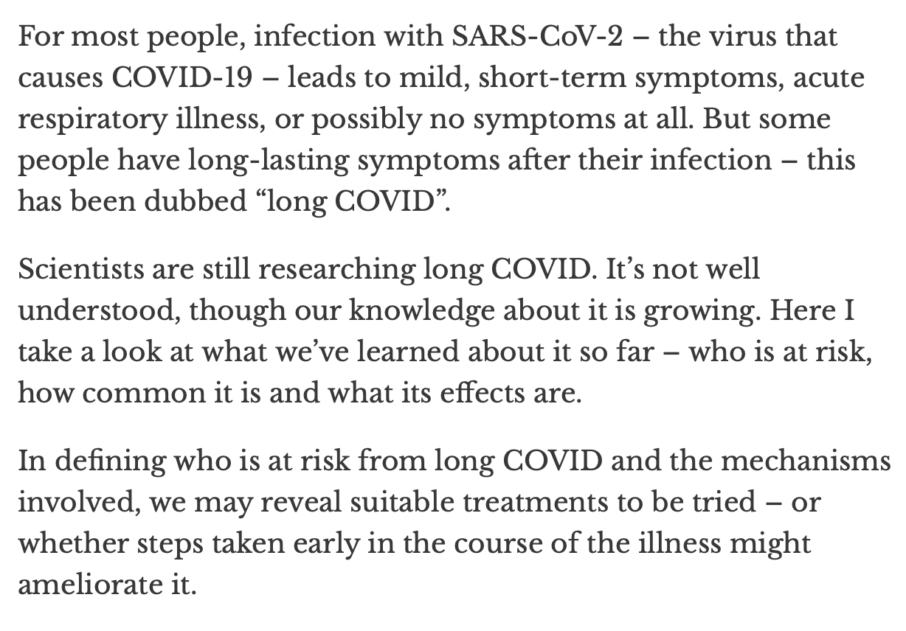

## Usage

```
USAGE: img2text <png-file>

ARGUMENTS:
  <png-file>              PNG file path.

OPTIONS:
  -h, --help              Show help information.
```

## Samples

### English



```sh
➜  img2text git:(master) ✗ ./bin/img2text examples/ml.png
For most people, infection with SARS-CoV-2 the virus that causes COVID-19 - leads to mild, short-term symptoms, acute respiratory illness, or possibly no symptoms at all. But some people have long-lasting symptoms after their infection this has been dubbed "long COVID". Scientists are still researching long COVID. It's not well understood, though our knowledge about it is growing. Here I take a look at what we've learned about it so far who is at risk, how common it is and what its effects are. In defining who is at risk from long COVID and the mechanisms involved, we may reveal suitable treatments to be tried - or whether steps taken early in the course of the illness might ameliorate it.
```

### Simple Chinese

Not supported yet

## Technical documents:

* WWDC: https://developer.apple.com/videos/play/wwdc2019/234/
* Doc: https://developer.apple.com/documentation/vision/recognizing_text_in_images
